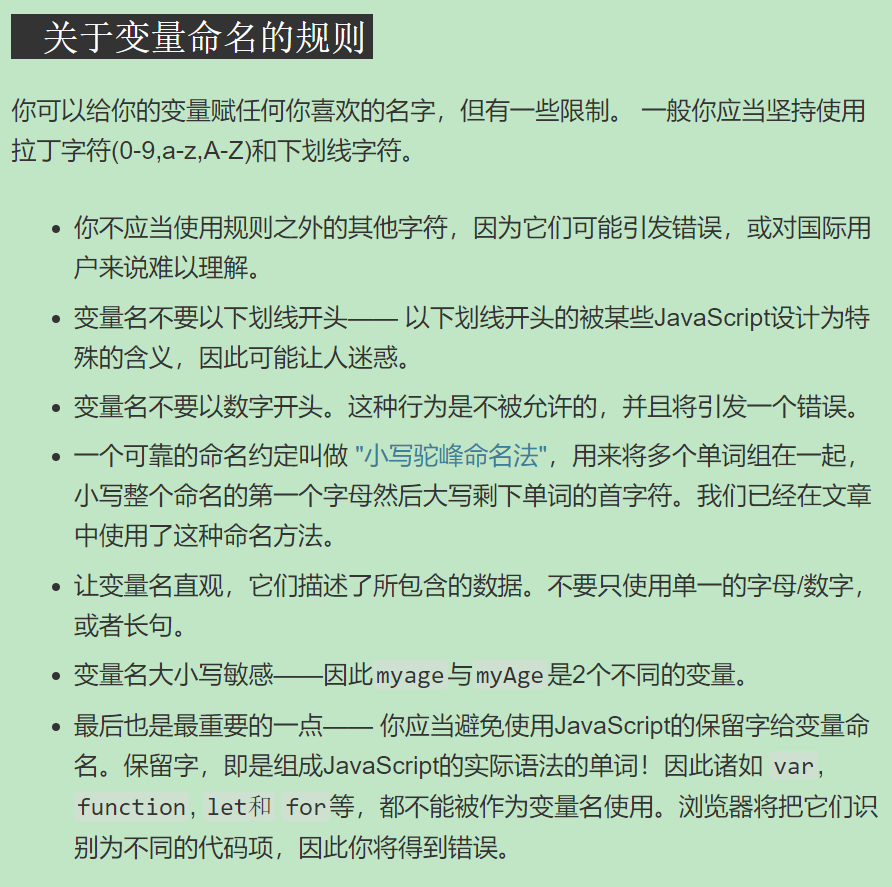

## 变量

### 一、变量是什么

1. 变量不是存储的数据本身，更贴切的说，变量就是一个用于存放任意东西的 容器 ，容器中可以存放数字、字符串甚至其他更复杂的数据，如函数等
2. 顾名思义，存在变量中的值是可以改变的
3. 例子:[demo01](https://github.com/DeLei33534/JavaScript_Learning_Review/blob/master/First_steps/page04/demo01.html)

### 二、变量的声明与更新

1. 使用变量的第一步是创建变量，即变量声明
2. 语法: let/var 变量名
3. 声明变量但是没有赋值，打印输出会得到一个 undefined 的返回值；使用一个从未声明的变量，则会报错
4. 为了避免不必要的麻烦，需要在变量声明后，对变量进行 初始化

   1. 变量的初始化，就是第一次为变量赋值的过程
   2. 可以在变量声明后，对变量进行赋值

      ```
        let name;
        name = "delei";

        /*
            在JavaScript中
            所有代码指令都会以分号结尾 (;)
            如果忘记加分号,单行代码可能执行正常
            但是在多行代码在一起的时候可能会出错
        */
      ```

   3. 也可以在声明变量的同时，对变量进行赋值
      ```
        let name = "delei";
      ```

5. 变量赋值后，可以通过重新赋予变量其他值来更新变量

### 三、var 与 let 的区别

1. 最初的 JS 中只有 var 关键字, 现代创建的 let 关键字是为了弥补，var 在一些开发场景中的不足
2. 使用 var/let 声明变量的区别
   1. 对于一个多行的 JS 程序，可以在初始化一个变量后，再用 var 进行声明，程序仍可正常工作([demo02](https://github.com/DeLei33534/JavaScript_Learning_Review/blob/master/First_steps/page04/demo02.html))
   2. let 不支持上述做法，增强了代码的逻辑性与严谨性
   3. 使用 var 时，可以根据需要多次相同名称的变量(相当于变更变量值)，如
   ```
   var myName = "delei";
   var myName = "chfeng";
   ```
   4. let 同样不支持上述做法
3. [var 关键字](https://developer.mozilla.org/zh-CN/docs/Web/JavaScript/Reference/Statements/var)

   1. 变量提升(var hoisting)

      1. 使用 var 声明的变量，总是会被放在任意代码开始执行前优先处理，这种行为叫做提升(hoisting)
      2. hoisting 就像是把所有的 var 变量声明，移动到函数或者全局代码的开头位置

      ```
       value = 2;
       var value;

       //可以隐式(implicitly)理解为

       var value;
       value = 2;
      ```

      1. 变量提升只会影响变量声明，而不会影响其值的初始化，只有执行到赋值语句时，变量才会被初始化

      ```
       /*
           //例一
           function todo(){
               console.log(value); // undefined
               var value = 123;
               console.log(value); // 123
           }

           //可以隐式(implicitly)理解为

           function todo(){
               var value;
               console.log(value); // undefined
               value = 123;
               console.log(value); // 123
           }
       */

       /*
          //例二，输出结果为undefinedA
          var x = y, y = 'A';
          console.log(x + y);

          //可以隐式(implicitly)理解为

          var x; // undefined
          var y; // undefined
          x = y; // undefined
          y = 'A'; // 'A'
          console.log(x + y); // undefinedA
       */
      ```

   2. 用 var 声明的变量，作用域是它当前的执行上下文

      1. 当前所在函数
      2. 对于声明在函数外的变量，为全局

      ```
      var x = 0; // x是全局变量，并且赋值为0

      console.log(typeof z); // undefined，因为z还不存在

      function a() { // 当a被调用时
         var y = 2; // y被声明成函数a作用域的变量，然后赋值成2

         console.log(x, y); // 0 2

         function b() { // 当b被调用时
            x = 3; // 全局变量x被赋值为3，不生成全局变量
            y = 4; // 已存在的外部函数的y变量被赋值为4，不生成新的全局变量
            z = 5; // 创建新的全局变量z，并且给z赋值为5
         }         // (在严格模式下（strict mode）抛出ReferenceError)

         b(); // 调用b时创建了全局变量z
         console.log(x, y, z); // 3 4 5
      }

      a(); // 调用a时同时调用了b
      console.log(x, z); // 3 5
      console.log(typeof y); // undefined，因为y是a函数的本地(local)变量
      ```

   3. 变量可重新声明(相同变量名)
   4. 当给未声明的变量进行赋值时, 该变量会被隐式地创建为全局变量，将成为全局对象的一个属性
   5. 声明变量与未声明变量的差异

      1. 声明变量的作用域限制在其声明位置的上下文中，而非声明变量总是全局的

      ```
         function x() {
            y = 1;   // 在严格模式(strict mode)下会
                     // 抛出 ReferenceError 异常
            var z = 2;
         }

         x();

         console.log(y); // 1
         console.log(z); // 抛出 ReferenceError:
                         // z 未在 x 外部声明
      ```

      1. 声明变量在任何代码执行前创建，而非声明变量只有在执行赋值操作的时候才会被创建
      2. 声明变量是它所在上下文环境的不可配置属性，非声明变量是可配置的,如非声明变量可以被删除

4. [let 关键字](https://developer.mozilla.org/zh-CN/docs/Web/JavaScript/Reference/Statements/let)

   1. let 声明的变量，只在其声明的块或子块中可用; 而 var 声明的变量，作用域是整个封闭函数(全局或者整个函数块)

   ```
   function varTest() {
      var x = 1;
      {
         var x = 2; // 同样的X变量
         console.log(x); / 2
      }
      console.log(x); // 2
   }

   function letTest() {
      let x = 1;
      {
         let x = 2; // 不同的X变量
         console.log(x); // 2
      }
      console.log(x); // 1
   }
   ```

   2. let 不会在全局对象里新建一个属性

   ```
   var x = 'global';
   let y = 'global1';
   console.log(this.x); // "global"
   console.log(this.y); // undefined
   ```

   3. 在处理构造函数的时候，可以通过 let 声明来创建一个或多个私有成员
   4. 在同一个函数或块作用域中，使用 let 重复声明同一个变量会引起 SyntaxError
   5. 通过 let 声明的变量, 直到它们的定义被执行时才初始化
   6. 在 let 变量初始化前访问，会导致 ReferenceError, 此时变量处在一个，自块顶部到初始化处理步骤的"暂存死区"(temporal dead zone,TDZ)中; 同样，使用 typeof 检测在暂存死区中的变量, 也会抛出 ReferenceError 异常

   ```
      function do_something() {
         // ---暂存死区---
         console.log(bar); // undefined
         console.log(foo); //  ReferenceError
         var bar = 1;
         // ---暂存死区---
         let foo = 2;
      }
   ```

   7. var 与 let 混合声明同名变量会报 SyntaxError 错误

   ```
   let x = 1;

   {
   var x = 2; // SyntaxError for re-declaration
   }
   ```

### 四、变量类型

1. JavaScript 是一种"动态类型语言", 在使用时不需要指定变量的具体类型，浏览器会自动根据存储的变量内容进行识别，随着内容的变更，其类型也会相应变化
2. JavaScript 中的变量类型:[demo03]()

### 五、变量命名规则


